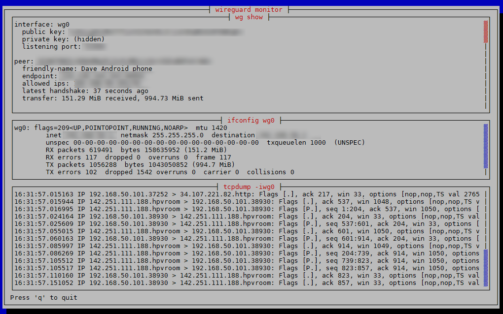

# wireguard-monitor
See what Wireguard is doing.

It runs 3 commands in a terminal GUI (a TUI).
- wg show: updated every second
- ifconfig wg0: updated every second
- tcpdump -i wg0: continuous scroll

Not very amazing but hopefully useful for somebody.

# Screenshot

# To use
Linux only

    git clone https://github.com/dmdmdm/wireguard-monitor
    cd wireguard-monitor
    cargo run

# Option
By default it uses interface `wg0` but you can specify a different interface on the command line, eg:

   cargo run wg4
